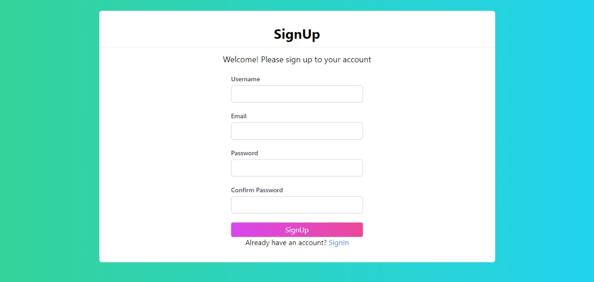
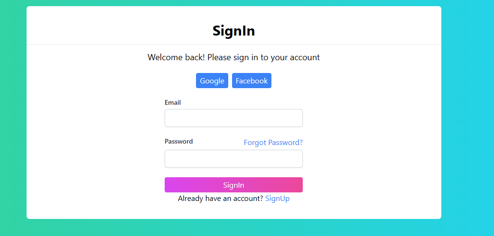
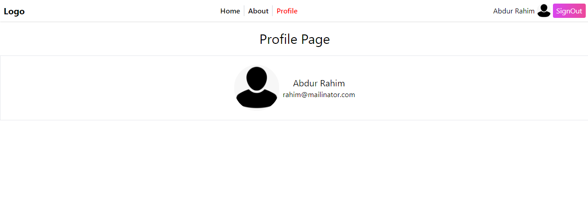

# Firebase Authentication with React

This is a simple project to demonstrate how to use Firebase Authentication with React. This project uses Firebase Authentication to authenticate users using email and password. It also demonstrates how to create a new user, sign in an existing user, sign out a user, and reset the password of a user.

## Prerequisites
- Node.js
- Firebase Account
- Firebase Project


## Installation in Local Machine
1. Clone this repository
```bash
git clone https://github.com/AbdurRaahimm/firebaseAuth.git
```
2. Change the directory
```bash
cd firebaseAuth
```
3. Run The Essential Dependency
```bash
npm install
```
4. Run `npm run dev` to start the development server
```bash
npm run dev
```
4. Run `npm run build` to build the project
```bash
npm run build
```


## Features 
- Create a new user
- Sign in an existing user
- Sign out a user
- Reset the password of a user
- Google Sign In

## Technologies Used
- React
- Firebase
- Tailwind CSS
- React Router
- React-Toastify

## Screenshots
1. Sign Up Page


2. Sign In Page


3. Profile Page



## Connect on Social Media
- [Twitter](https://twitter.com/AbdurRahim4G)
- [Instagram](https://www.instagram.com/abdurrahim4g/)
- [Facebook](https://www.facebook.com/Rahim72446)
- [LinkedIn](https://www.linkedin.com/in/abdur-rahim4g/)
- [YouTube](https://youtube.com/@AbdurRahimm)


